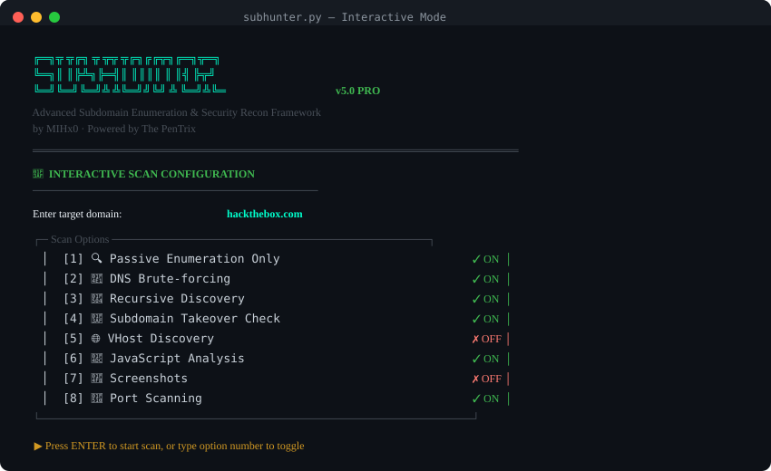
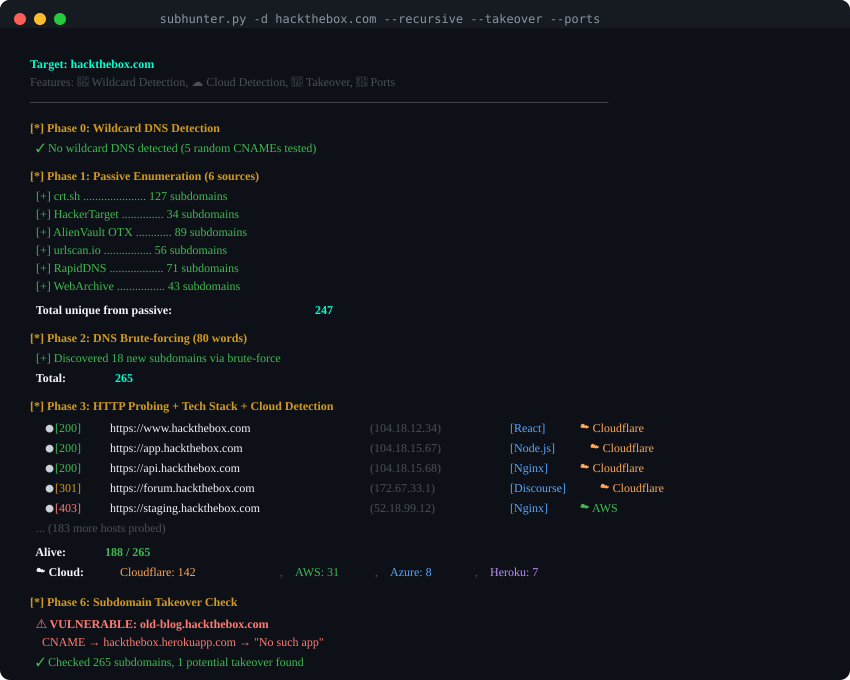
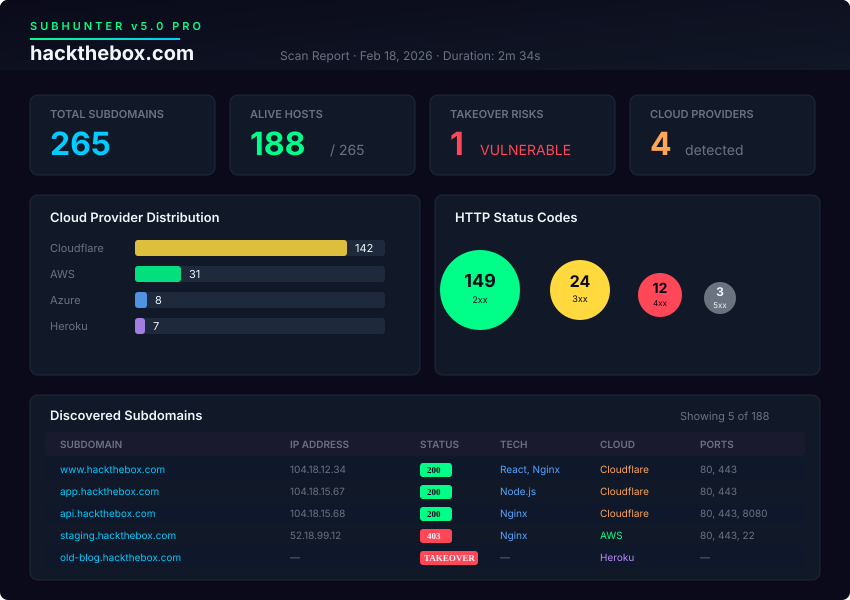
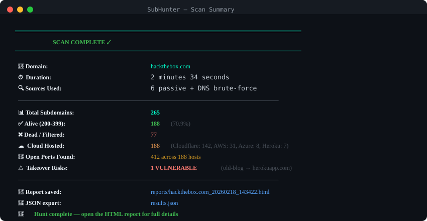

<div align="center">

<!-- Hero Banner -->


<br><br>

```
  ╔═╗╦ ╦╔╗ ╦ ╦╦ ╦╔╗╔╔╦╗╔═╗╦═╗
  ╚═╗║ ║╠╩╗╠═╣║ ║║║║ ║ ║╣ ╠╦╝
  ╚═╝╚═╝╚═╝╩ ╩╚═╝╝╚╝ ╩ ╚═╝╩╚═  v5.0 PRO
```

### ⚡ Advanced Subdomain Enumeration & Security Reconnaissance Framework

*Built for penetration testers, bug bounty hunters, and security researchers*

<br>

[](https://python.org)
[](LICENSE)
[](tests/)
[](#installation)

[](https://docs.python.org/3/library/asyncio.html)
[](https://github.com/mizazhaider-ceh/Sub-Hunter)
[](https://github.com/mizazhaider-ceh/Sub-Hunter)
[](https://github.com/mizazhaider-ceh/Sub-Hunter)
[](https://peps.python.org/pep-0008/)

<br>

**SubHunter** discovers subdomains at scale using passive intelligence & active brute-forcing,<br>
then probes, fingerprints, and reports on every host — all in one async pipeline.

<br>

[**Getting Started**](#-quick-start) · [**Screenshots**](#-screenshots) · [**Features**](#-features) · [**Documentation**](#-usage) · [**Security**](SECURITY.md)

<br>

</div>

---

<br>

## 🖼️ Screenshots

<details open>
<summary><b>🎮 Interactive TUI Mode</b> — Launch without arguments for a guided experience</summary>
<br>
<p align="center">
  
</p>
</details>

<details open>
<summary><b>⚡ Live Scan Output</b> — Real-time progress with color-coded phases</summary>
<br>
<p align="center">
  
</p>
</details>

<details open>
<summary><b>📊 HTML Report Dashboard</b> — Premium dark-themed reports with charts & tables</summary>
<br>
<p align="center">
  
</p>
</details>

<details open>
<summary><b>✅ Scan Summary</b> — Clear results at a glance</summary>
<br>
<p align="center">
  
</p>
</details>

<br>

---

<br>

## 🤔 Why SubHunter?

<table>
<tr>
<td width="50%">

### ❌ The Problem

- Manual enumeration across scattered tools
- Wildcard DNS flooding results with false positives
- No infrastructure context (cloud, tech, ports)
- Flat text output with no actionable intelligence
- No takeover or vulnerability detection
- Slow, sequential scanning

</td>
<td width="50%">

### ✅ SubHunter's Solution

- **All-in-one** pipeline: enumerate → probe → scan → report
- **Smart wildcard detection** filters false positives automatically
- **Cloud detection** across 11 providers + tech fingerprinting
- **Premium HTML reports** with charts, tables, and export
- **Takeover detection** for 20+ services (S3, Heroku, GitHub, etc.)
- **Async architecture** with 100+ concurrent queries

</td>
</tr>
</table>

<br>

---

<br>

## ✨ Features

<table>
<tr><td>

### 🔍 Reconnaissance
| Feature | Details |
|:--------|:--------|
| **Passive OSINT** | 6 sources: crt.sh, HackerTarget, AlienVault OTX, urlscan.io, RapidDNS, WebArchive |
| **DNS Brute-force** | Dictionary attack with custom wordlist support |
| **Recursive Discovery** | Sub-subdomains (`dev.api.target.com`) with configurable depth |
| **Wildcard Filtering** | Auto-detect & filter wildcard DNS false positives |

</td></tr>
<tr><td>

### 🎯 Security Analysis
| Feature | Details |
|:--------|:--------|
| **Subdomain Takeover** | Detect vulnerable CNAMEs across 20+ services |
| **VHost Discovery** | Hidden virtual hosts via Host header fuzzing |
| **JS Analysis** | Extract API secrets, endpoints, and subdomains from JavaScript |
| **Port Scanning** | 17 common ports (SSH, HTTP, MySQL, RDP, etc.) |
| **HTTP Probing** | Status codes, headers, tech stack, response times |

</td></tr>
<tr><td>

### ☁️ Infrastructure Intelligence
| Feature | Details |
|:--------|:--------|
| **Cloud Detection** | AWS, Azure, GCP, Cloudflare, Heroku, Vercel, Netlify + 4 more |
| **Tech Fingerprinting** | WordPress, React, Angular, Django, Laravel, Nginx, Apache, etc. |
| **CNAME Mapping** | Full CNAME chain resolution for every subdomain |

</td></tr>
<tr><td>

### 📊 Output & UX
| Feature | Details |
|:--------|:--------|
| **HTML Reports** | Premium dark-themed dashboard with charts, tables, XSS-safe |
| **Interactive TUI** | Beautiful terminal UI when run without arguments |
| **Resume Scans** | Save & resume interrupted scans seamlessly |
| **Multi-format** | Export to HTML, JSON, or plain text |
| **Screenshot Capture** | Playwright or Selenium with auto-fallback |

</td></tr>
</table>

<br>

---

<br>

## 🚀 Quick Start

```bash
# Clone
git clone https://github.com/mizazhaider-ceh/Sub-Hunter.git
cd Sub-Hunter

# Setup (recommended: virtual environment)
python -m venv venv
source venv/bin/activate        # Linux/macOS
# venv\Scripts\activate         # Windows

# Install
pip install -r requirements.txt

# Run
python subhunter.py -d example.com
```

<details>
<summary><b>📸 Optional: Screenshots Setup</b></summary>
<br>

**Playwright (Recommended):**
```bash
pip install playwright
playwright install chromium
```

**Selenium (Fallback):**
```bash
pip install selenium webdriver-manager
```

> SubHunter auto-detects which engine is available.

</details>

<details>
<summary><b>🔑 Optional: API Keys for Enhanced Results</b></summary>
<br>

Copy `.env.example` to `.env` and add keys for deeper passive enumeration:

```bash
cp .env.example .env
```

| Source | Key Required | Free Tier |
|--------|:---:|:---:|
| crt.sh | No | ∞ |
| HackerTarget | No | ∞ |
| AlienVault OTX | No | ∞ |
| urlscan.io | No | ∞ |
| SecurityTrails | Optional | 50/mo |
| Shodan | Optional | 100/mo |

</details>

<br>

---

<br>

## 📋 Usage

### Interactive Mode
```bash
python subhunter.py
```
> Launches a guided TUI — select features, enter domain, and go.

### Command-Line Examples

```bash
# Basic scan (passive + brute-force + probing)
python subhunter.py -d target.com

# Full security audit — everything enabled
python subhunter.py -d target.com --recursive --takeover --vhost --js-parse --ports --screenshots

# Passive only — no active scanning
python subhunter.py -d target.com --no-brute --no-probe

# Custom wordlist + JSON output
python subhunter.py -d target.com -w /path/to/wordlist.txt -o results.json

# Resume an interrupted scan
python subhunter.py -d target.com --resume

# Quiet mode with high concurrency
python subhunter.py -d target.com -c 200 -q --html report.html
```

<br>

### ⚙️ Full Options Reference

| Option | Description | Default |
|:-------|:-----------|:--------|
| `-d, --domain` | Target domain **(required)** | — |
| `-w, --wordlist` | Custom wordlist for brute-forcing | Built-in (80 words) |
| `-o, --output` | Output file (`.txt` or `.json`) | — |
| `--html` | Custom HTML report path | Auto → `reports/` |
| `--recursive` | Enable recursive sub-subdomain discovery | Off |
| `--recursive-depth` | Max recursion depth | `2` |
| `--takeover` | Check for subdomain takeover vulnerabilities | Off |
| `--vhost` | Discover virtual hosts via Host header fuzzing | Off |
| `--js-parse` | Extract secrets & endpoints from JS files | Off |
| `--ports` | Enable port scanning (17 ports) | Off |
| `--screenshots` | Capture screenshots of alive hosts | Off |
| `--no-brute` | Skip DNS brute-forcing | Off |
| `--no-probe` | Skip HTTP probing | Off |
| `--no-wildcard-filter` | Disable wildcard DNS filtering | Off |
| `--resume` | Resume previous scan | Off |
| `-c, --concurrency` | Concurrent queries | `100` |
| `-q, --quiet` | Suppress output except results | Off |
| `--interactive` | Force interactive TUI mode | Off |

<br>

---

<br>

## 🧠 How It Works

### Scanning Pipeline

```
┌─────────────┐    ┌──────────────┐    ┌───────────────┐    ┌───────────────┐
│   Phase 0   │───▶│   Phase 1    │───▶│   Phase 2     │───▶│  Phase 2.5    │
│  Wildcard   │    │   Passive    │    │  Brute-force  │    │  Recursive    │
│  Detection  │    │   OSINT (6)  │    │  DNS Wordlist │    │  Discovery    │
└─────────────┘    └──────────────┘    └───────────────┘    └───────┬───────┘
                                                                    │
                       ┌────────────────────────────────────────────┘
                       ▼
              ┌──────────────┐
              │   Phase 3    │
              │  HTTP Probe  │ ←── Tech Detection + Cloud ID + Headers
              │  + Tech + ☁️  │
              └───────┬──────┘
                      │
     ┌────────────────┼────────────────┐
     ▼                ▼                ▼
┌──────────┐  ┌──────────────┐  ┌──────────────┐
│ Phase 4  │  │   Phase 5    │  │ Phase 6-7-8  │
│  Ports   │  │ Screenshots  │  │   Takeover   │
│ Scanner  │  │  Playwright  │  │ VHost · JS   │
└────┬─────┘  └──────┬───────┘  └──────┬───────┘
     │               │                 │
     └───────────────┼─────────────────┘
                     ▼
              ┌─────────────┐
              │   Report    │
              │  Generator  │  →  HTML / JSON / TXT
              │  (XSS-safe) │
              └─────────────┘
```

<br>

### Key Technical Details

<details>
<summary><b>🧠 Wildcard DNS Detection</b></summary>
<br>

SubHunter resolves **5 random subdomains** (e.g., `a8x9k2m1p3.target.com`). If all return the same IP, wildcard DNS is detected and those IPs are filtered from all results to eliminate false positives. This prevents thousands of junk entries from polluting your data.

</details>

<details>
<summary><b>☁️ Cloud Provider Detection (11 Providers)</b></summary>
<br>

Uses a **priority-based detection strategy:**

| Priority | Method | Reliability | Example |
|:--------:|:-------|:----------:|:--------|
| 1st | **CNAME records** | ★★★ | `*.s3.amazonaws.com` → AWS |
| 2nd | **HTTP headers** | ★★☆ | `cf-ray` header → Cloudflare |
| 3rd | **IP ranges** | ★☆☆ | `104.16.x.x` → Cloudflare |

**Supported Providers:**

| Provider | CNAME | Headers | IP Range |
|:---------|:-----:|:-------:|:--------:|
| AWS | ✅ | ✅ | ✅ |
| Azure | ✅ | ✅ | ✅ |
| GCP | ✅ | ✅ | ✅ |
| Cloudflare | ✅ | ✅ | ✅ |
| DigitalOcean | ✅ | — | ✅ |
| Heroku | ✅ | ✅ | — |
| Netlify | ✅ | ✅ | — |
| Vercel | ✅ | ✅ | — |
| Fastly | ✅ | ✅ | — |
| Akamai | ✅ | — | — |
| GitHub Pages | ✅ | — | ✅ |

</details>

<details>
<summary><b>🎯 Subdomain Takeover Detection (20+ Services)</b></summary>
<br>

SubHunter checks CNAME records against known vulnerable patterns, then verifies with HTTP response fingerprints:

| Service | CNAME Pattern | Fingerprint |
|:--------|:-------------|:------------|
| GitHub Pages | `*.github.io` | `There isn't a GitHub Pages site here` |
| Heroku | `*.herokuapp.com` | `No such app` |
| AWS S3 | `*.s3.amazonaws.com` | `NoSuchBucket` |
| Shopify | `*.myshopify.com` | `Sorry, this shop is currently unavailable` |
| Azure | `*.azurewebsites.net` | `404 Web Site not found` |
| Surge.sh | `*.surge.sh` | `project not found` |
| Fastly | `*.fastly.net` | `Fastly error: unknown domain` |
| Ghost | `*.ghost.io` | `The thing you were looking for is no longer here` |
| Tumblr | `*.tumblr.com` | `There's nothing here` |
| WordPress | `*.wordpress.com` | `Do you want to register` |
| *...and 10+ more* | | |

</details>

<details>
<summary><b>🔐 Port Scanner</b></summary>
<br>

| Port | Service | Port | Service |
|:----:|:--------|:----:|:--------|
| 21 | FTP | 443 | HTTPS |
| 22 | SSH | 445 | SMB |
| 23 | Telnet | 993 | IMAPS |
| 25 | SMTP | 995 | POP3S |
| 53 | DNS | 3306 | MySQL |
| 80 | HTTP | 3389 | RDP |
| 110 | POP3 | 5432 | PostgreSQL |
| 143 | IMAP | 8080 | HTTP-Alt |
| | | 8443 | HTTPS-Alt |

</details>

<br>

---

<br>

## 🏗️ Architecture

```
Sub-Hunter/
├── subhunter.py             # CLI/TUI entry point — dual-mode launcher
├── core/                    # Core scanning engine
│   ├── dns.py               #   DNS resolution, brute-forcing, recursive discovery
│   ├── probe.py             #   HTTP probing + tech detection + cloud detection
│   ├── scanner.py           #   Async TCP port scanner
│   ├── wildcard.py          #   Wildcard DNS detection & filtering
│   ├── cloud.py             #   Cloud provider identification (11 providers)
│   ├── takeover.py          #   Subdomain takeover vulnerability detection
│   ├── vhost.py             #   Virtual host discovery via Host header fuzzing
│   ├── jsparse.py           #   JavaScript file analysis for secrets & endpoints
│   ├── screenshot.py        #   Screenshot capture (Playwright/Selenium fallback)
│   └── report.py            #   Premium HTML report generator (XSS-safe)
├── sources/                 # Passive OSINT data collection
│   └── passive.py           #   6 passive sources with async parallel fetching
├── utils/                   # Shared utilities & configuration
│   ├── config.py            #   Constants, wordlists, tech signatures, ports
│   ├── display.py           #   Terminal colors, banner, progress formatting
│   └── menu.py              #   Interactive TUI menu system
├── tests/                   # Test suite (49 tests)
│   └── test_subhunter.py    #   Domain validation, cloud, XSS, CLI, takeover tests
├── reports/                 # Auto-saved HTML scan reports
├── assets/                  # README screenshots & media
├── requirements.txt         # Python dependencies
├── .env.example             # Environment variable template (API keys)
├── SECURITY.md              # Security policy & responsible disclosure
└── LICENSE                  # MIT License
```

<br>

---

<br>

## 🧪 Testing

```bash
# Run all 49 tests
python -m pytest tests/ -v

# Run with coverage report
python -m pytest tests/ -v --tb=short

# Run specific test class
python -m pytest tests/test_subhunter.py::TestCloudDetection -v
```

**Test Coverage:**

| Test Suite | Tests | What's Tested |
|:-----------|:-----:|:--------------|
| `TestDomainValidation` | 14 | Valid/invalid domain regex patterns |
| `TestCloudDetection` | 11 | CNAME, header, IP-based cloud identification |
| `TestWildcardDetection` | 5 | Wildcard result parsing, filtering, random generation |
| `TestReportSecurity` | 3 | XSS payload escaping in HTML reports |
| `TestConfig` | 3 | Wordlists, ports, tech signatures |
| `TestDisplay` | 3 | Version, colors, banner rendering |
| `TestCLI` | 6 | Argument parsing (all flags including v5.0 additions) |
| `TestTakeoverSignatures` | 2 | Signature loading, fingerprint structure |
| `TestStateManagement` | 2 | Save/load/clear scan state |

<br>

---

<br>

## 🛡️ Security Considerations

| Area | Policy |
|:-----|:-------|
| **Authorization** | Only scan domains you have explicit permission to test |
| **SSL Verification** | Intentionally disabled for security assessment (standard pentest practice) |
| **XSS Prevention** | All user-controlled data is HTML-escaped in generated reports |
| **Secrets Management** | API keys stored in `.env` (git-ignored), never hardcoded |
| **State Files** | Plaintext JSON — delete after scan completion |
| **Rate Limiting** | Use `-c` flag to control concurrency and avoid API abuse |

> 📋 See [SECURITY.md](SECURITY.md) for our responsible disclosure policy.

<br>

---

<br>

## 🔮 Roadmap

| Feature | Status | Priority |
|:--------|:------:|:--------:|
| WAF Detection (Cloudflare, Akamai, AWS WAF) | 🔜 Planned | High |
| Permutation Scanning (`dev-api`, `v1-test`, `stg-app`) | 🔜 Planned | High |
| Email Harvesting from discovered hosts | 🔜 Planned | Medium |
| API Key Integrations (Shodan, SecurityTrails, Censys) | 🔜 Planned | Medium |
| CI/CD Pipeline Integration (GitHub Actions) | 🔜 Planned | Low |
| Docker Container | 🔜 Planned | Low |

<br>

---

<br>

## 📦 Tech Stack

| Layer | Technology | Purpose |
|:------|:-----------|:--------|
| **Runtime** | Python 3.8+ | Core language |
| **Async I/O** | asyncio | High concurrency (100+ simultaneous queries) |
| **HTTP** | httpx | Modern async HTTP client with HTTP/2 |
| **DNS** | aiodns | Async DNS resolution via c-ares |
| **Screenshots** | Playwright / Selenium | Headless browser capture with auto-fallback |
| **Reports** | HTML / CSS / JS | Premium dark-themed dashboard reports |
| **Testing** | pytest | 49 unit & integration tests |

<br>

---

<br>

## 🤝 Contributing

Contributions are welcome! Here's how:

1. **Fork** the repository
2. **Create** a feature branch: `git checkout -b feature/amazing-feature`
3. **Commit** your changes: `git commit -m 'Add amazing feature'`
4. **Push** to the branch: `git push origin feature/amazing-feature`
5. **Open** a Pull Request

> Please read [SECURITY.md](SECURITY.md) before submitting security-related changes.

<br>

---

<br>

## 📄 License

This project is licensed under the **MIT License** — see the [LICENSE](LICENSE) file for details.

<br>

---

<br>

<div align="center">

### 👤 Author

**Mizaz Haider** (MIHx0)

[](https://github.com/mizazhaider-ceh)
[](https://linkedin.com/in/mizazhaider)

*Cybersecurity Student · Junior DevSecOps Engineer*

Powered by **The PenTrix** ⚡

<br>

---

<br>


**Hunt them all** 🎯

<sub>⚠️ For authorized security testing only. Always obtain written permission before scanning any target.</sub>

</div>
